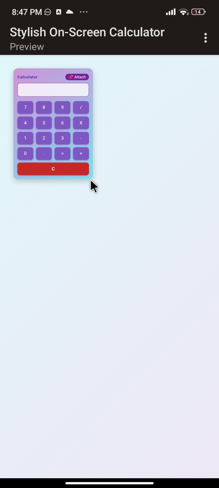
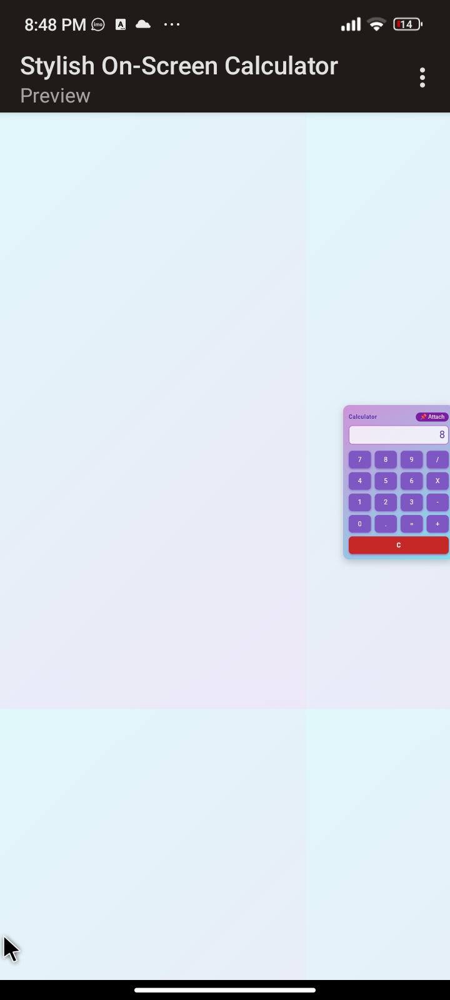
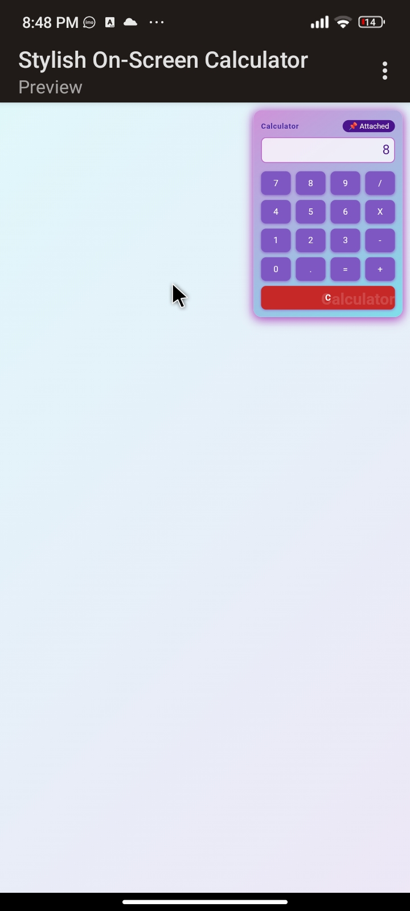

# Beautiful On-Screen Calculator

A modern, vibrant, and fully-featured on-screen calculator built with a single HTML file.  
This calculator is draggable, resizable, and features an attach (keep-on-top) mode for convenience.  
Designed with a fresh look and intuitive interface, it’s perfect for any desktop or web project.

---

## 🚀 Features

- **Modern Vibrant UI:**  
  Beautiful, gradient-inspired color palette with rounded corners and subtle shadows for a contemporary look.

- **Attach (Keep-on-Top) Mode:**  
  Click the 📌 Attach button to fix the calculator to the top-right corner of your screen.  
  In this mode, the calculator cannot be moved or resized, making it always accessible over your workspace.

- **Draggable Window:**  
  When not attached, drag the calculator by its header to any position within the viewport.

- **Resizable:**  
  Resize the calculator by dragging the bottom-right corner handle. Sizing is restricted to the visible area, ensuring it never goes off-screen.

- **Big Equals Button:**  
  A large “=” button at the bottom makes it easy to perform calculations.  
  The clear (“C”) button is available as a regular button for quick input reset.

- **Responsive Design:**  
  Adapts to smaller screens for usability on various devices.

- **Single HTML File:**  
  All HTML, CSS, and JavaScript are contained in one file for easy use and deployment.

---

## 🖥️ Demo

> Download or clone this repo, then simply open `index.html` in your browser.

---

## 📝 Usage

- **Numbers and Operators:** Click buttons to enter your calculation.
- **Clear (C):** Resets the current input.
- **Equals (=):** Press the large equals button to evaluate your input.
- **Attach (📌):** Click "Attach" to pin the calculator to the top-right. Click again to detach.
- **Drag:** When not attached, drag the calculator by its header to reposition it.
- **Resize:** When not attached, drag the bottom-right corner to resize.

---

## 📦 Installation

No installation required!

1. Copy the HTML code into a file named `index.html`.
2. Open the file in your web browser.

---

## 📸 Screenshot

  <h1> Calculator Preview</h1>

  <h1> Calculator Resized View</h1>
  <h1>Calculator Attached View</h1>

---

## ⚡ Tech Stack

- **HTML5**
- **CSS3**
- **Vanilla JavaScript**

---

## 🤝 Contributing

Feel free to fork this project and submit pull requests to add features or fix bugs!

---

## 📄 License

This project is open source and available under the [MIT License](LICENSE).

---

**Enjoy your beautiful, attachable on-screen calculator!**

---

